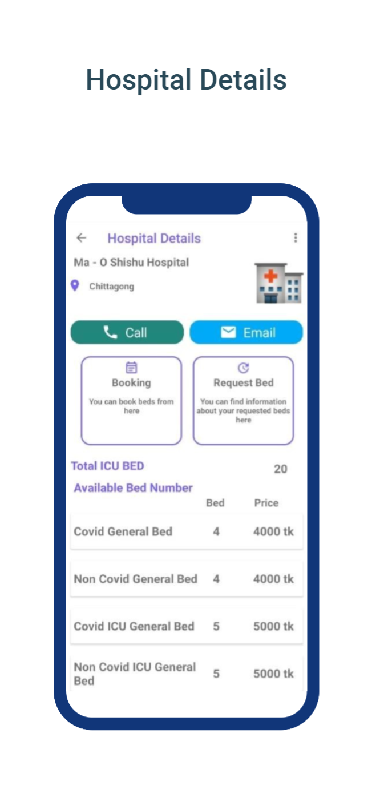

## Welcome to the ICUBedFinder!
## Subah Nawar
ICU Bed Finder App is an android app developed using Android Studio Platform. It is a simple app with following features:-
1. The app collects the information of available hospital beds including icu bed, general beds from various hospitals.

2. It allows the user to book a bed of their choice. 

3. They can collect a payment card for their transaction.
 
4. The app updates its information in real-time. 

5. User will also find the details information of the hospitals such as location, contact details etc. 

6. Hospital admins can manage their respective hospitals info which will be updated to all of the users' database.

7. Attractive UI design

8. Users can also leave comments and reviews

9. Easy to use

 

